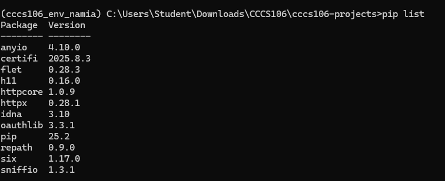
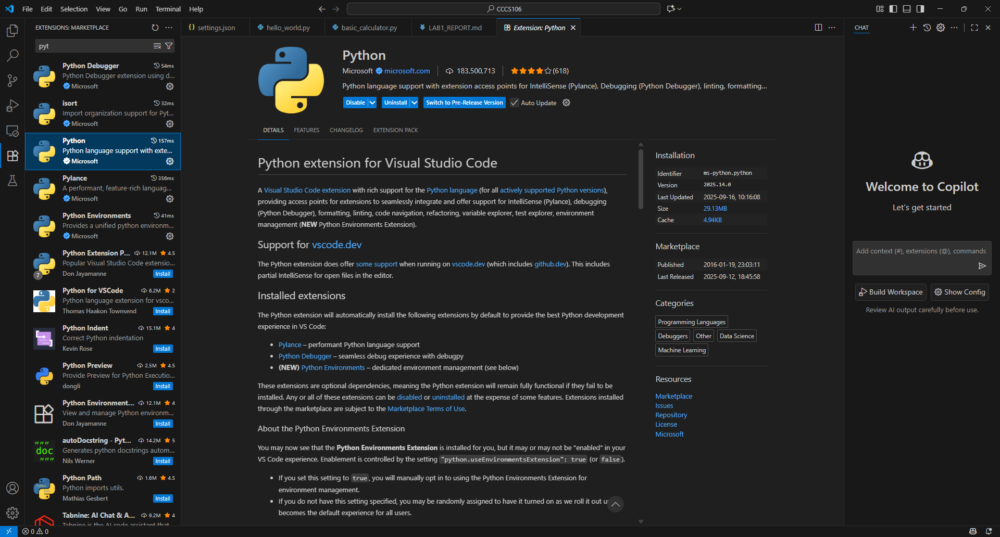
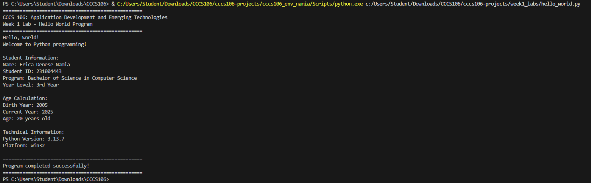
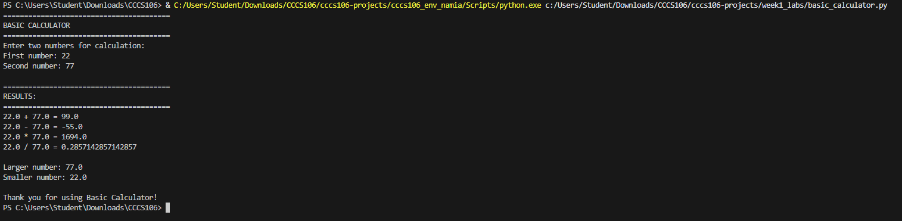

# Lab 1 Report: Environment Setup and Python Basics

**Student Name:** Erica Denese Namia
**Student ID:** 231004443
**Section:** BSCS 3B
**Date:** [Submission Date]

## Environment Setup

### Python Installation
- **Python Version:** [e.g., 3.11.5]
- **Installation Issues:** None
- **Virtual Environment Created:** ✅ cccs106_env_namia

### VS Code Configuration
- **VS Code Version:** 1.104.0
- **Python Extension:** ✅ Installed and configured
- **Interpreter:** ✅ Set to cccs106_env_namia/Scripts/python.exe

### Package Installation
- **Flet Version:** 0.28.3
- **Other Packages:** [List any additional packages]

## Programs Created

### 1. hello_world.py
- **Status:** ✅ Completed
- **Features:** Student info display, age calculation, system info
- **Notes:** None

### 2. basic_calculator.py
- **Status:** ✅ Completed
- **Features:** Basic arithmetic, error handling, min/max calculation
- **Notes:** None

## Challenges and Solutions

tingnan at basahin ng maagi ang instruction

## Learning Outcomes

intindihin bawat code para d magkaroon ng maraming error

## Screenshots

