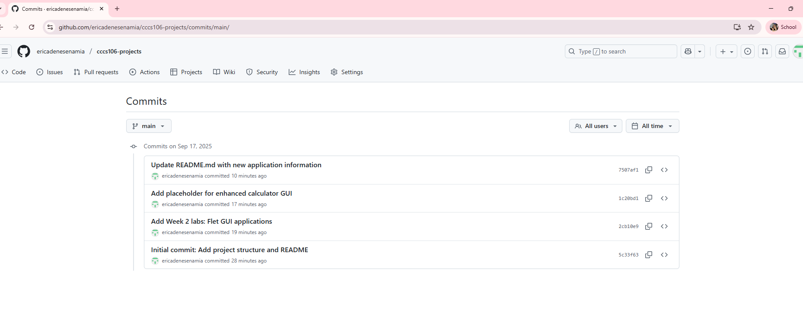
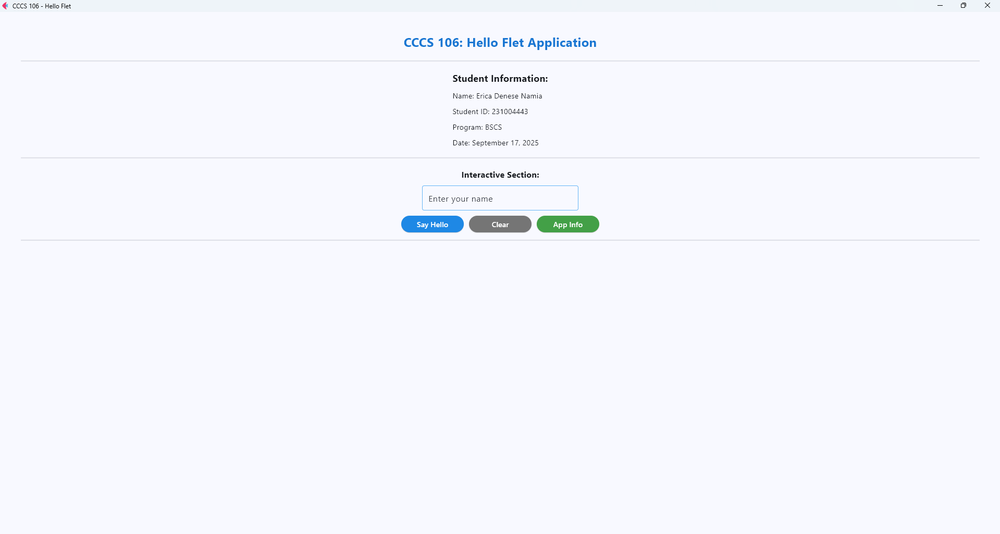
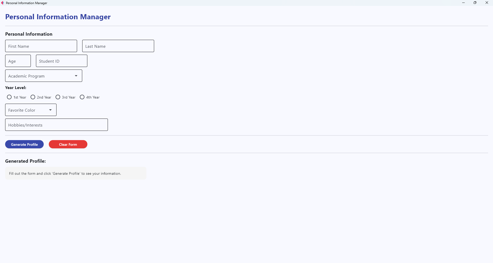

# Lab 2 Report: Git Version Control and Flet GUI Development

**Student Name:** Erica Denese Namia
**Student ID:** 231004443
**Section:** BSCS 3B
**Date:** [Submission Date]

## Git Configuration

### Repository Setup
- **GitHub Repository:** [\[Your repository URL\]](https://github.com/ericadenesenamia/cccs106-projects)
- **Local Repository:** ✅ Initialized and connected
- **Commit History:** 5 commits with descriptive messages

### Git Skills Demonstrated
- ✅ Repository initialization and configuration
- ✅ Adding, committing, and pushing changes
- ✅ Branch creation and merging
- ✅ Remote repository management

## Flet GUI Applications

### 1. hello_flet.py
- **Status:** ✅ Completed
- **Features:** Interactive greeting, student info display, dialog boxes
- **UI Components:** Text, TextField, Buttons, Dialog, Containers
- **Notes:** None
### 2. personal_info_gui.py
- **Status:** ✅ Completed
- **Features:** Form inputs, dropdowns, radio buttons, profile generation
- **UI Components:** TextField, Dropdown, RadioGroup, Containers, Scrolling
- **Error Handling:** Input validation and user feedback
- **Notes:** None

## Technical Skills Developed

### Git Version Control
- Understanding of repository concepts
- Basic Git workflow (add, commit, push)
- Branch management and merging
- Remote repository collaboration

### Flet GUI Development
- Flet 0.28.3 syntax and components
- Page configuration and layout management
- Event handling and user interaction
- Modern UI design principles

## Challenges and Solutions

yung pag run sa cmd na hindi napalitan yung username. dapat palitan at tingnan agad 

## Learning Outcomes

Be more productive

## Screenshots

### Git Repository

### GUI Applications

## Future Enhancements

None